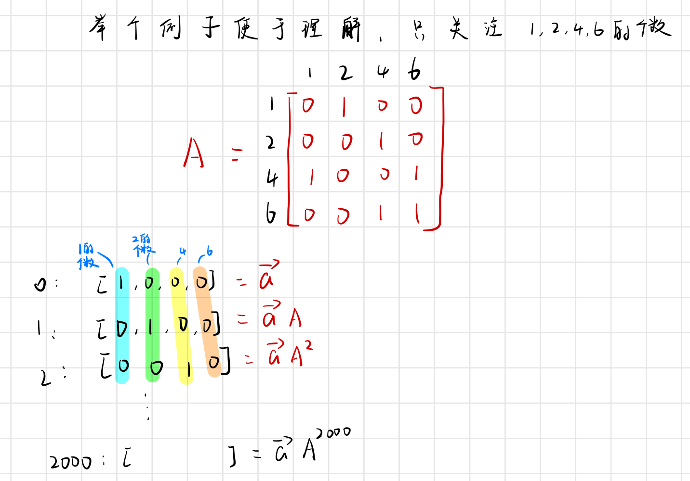
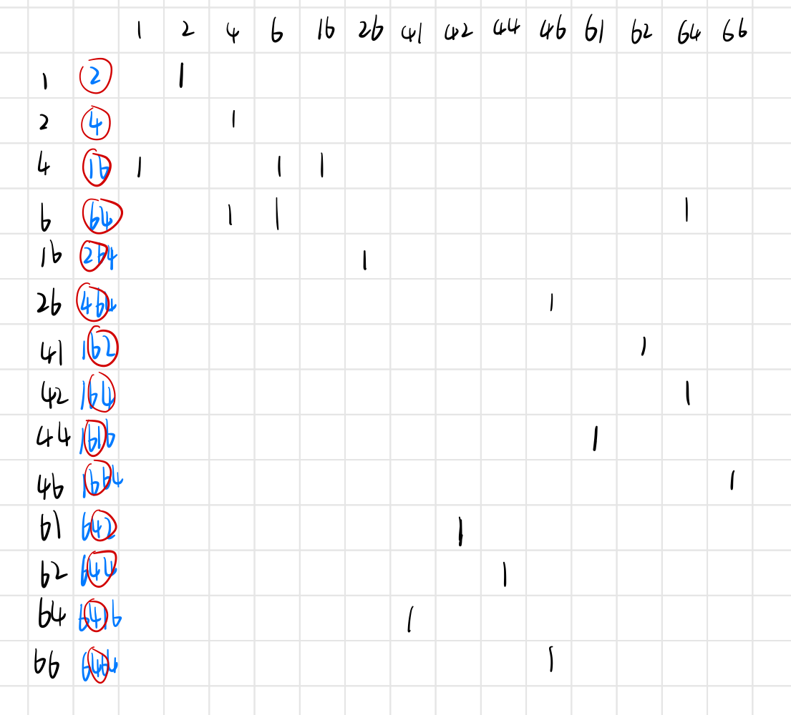

# 1246
## key point
* 暴力破解：模拟字符串的更新过程，由于数据过大，容易超时。
* 每一秒的子字符串个数可以由上一秒的母字符串个数得到。如想要知道**i**秒的16（子字符串）的个数，只需知道**i-1**秒字符串4（母字符串）的个数。由于测试数据绝大部分长度都不超过3，所以要找出一位数和两位数的母字符串。
  这样，我们就通过矩阵A的n次幂得到答案。但是我们这需要的是两位数的矩阵。那么根据手动推算，只能得到以下共10个可能的两位数，加上4个一位数，得到14*14的矩阵。
  注意64只能得到41，不能把64和16算入内，因为它们分别是6和4的子字符串，加进去就重复计算了。
* 矩阵的幂可以通过[快速幂算法原理](https://www.geeksforgeeks.org/write-an-iterative-olog-y-function-for-powx-y/)加快运算。
## code
* 96分
```cpp
#include<iostream>
#include<map>
using namespace std;
int MOD=998244353;
struct matrix{
	long long data[14][14];
};
matrix E;
matrix dot(matrix a,matrix b){
	matrix ans;
	for(int i=0;i<14;i++){
		for(int j=0;j<14;j++){
			long long temp=0;
			for(int k=0;k<14;k++){
				temp+=(a.data[i][k]*b.data[k][j])%MOD;
				if(temp>=MOD) temp%=MOD;
			} 
			ans.data[i][j]=temp;
		}
	}
	return ans;
}
matrix quickPow(matrix m,int n){
	matrix ans=E;
	while(n>0){
		if(n&1){
			ans=dot(ans,m);
		}
		n/=2;
		m=dot(m,m);
	}
	return ans;
}
int main(){
	int n,s;
	scanf("%d%d",&n,&s);
	map<int,int> mp;
	mp[1]=0;mp[2]=1;mp[4]=2;mp[6]=3;mp[16]=4;mp[26]=5;mp[41]=6;mp[42]=7;mp[44]=8;mp[46]=9;mp[61]=10;mp[62]=11;mp[64]=12;mp[66]=13;
	matrix mx={{
		{0,1,0,0,0,0,0,0,0,0,0,0,0,0},
		{0,0,1,0,0,0,0,0,0,0,0,0,0,0},
		{1,0,0,1,1,0,0,0,0,0,0,0,0,0},
		{0,0,1,1,0,0,0,0,0,0,0,0,1,0},
		{0,0,0,0,0,1,0,0,0,0,0,0,0,0},
		{0,0,0,0,0,0,0,0,0,1,0,0,0,0},
		{0,0,0,0,0,0,0,0,0,0,0,1,0,0},
		{0,0,0,0,0,0,0,0,0,0,0,0,1,0},
		{0,0,0,0,0,0,0,0,0,0,1,0,0,0},
		{0,0,0,0,0,0,0,0,0,0,0,0,0,1},
		{0,0,0,0,0,0,0,1,0,0,0,0,0,0},
		{0,0,0,0,0,0,0,0,1,0,0,0,0,0},
		{0,0,0,0,0,0,1,0,0,0,0,0,0,0},
		{0,0,0,0,0,0,0,0,0,1,0,0,0,0}
	}};
	for(int i=0;i<14;i++){
		E.data[i][i]=1;
	}
	matrix ans=quickPow(mx,n);
	printf("%lld",ans.data[0][mp[s]]);
	return 0;
}
```
* 100分的代码需要处理长度大于2的字符串，想法是通过将**j**秒的字符串回溯到**i**秒，其长度降为不超过2，这样可以通过第**i**秒的矩阵幂得到答案。待更新。