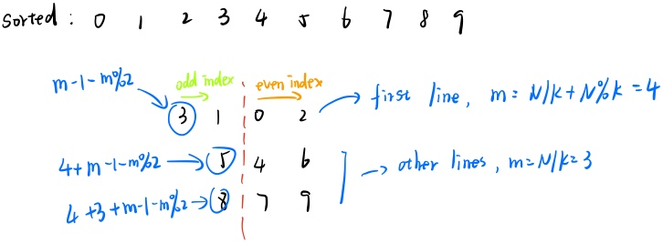

# Group Photo
## key point
* It's basically a math problem. According to the description, the first line we output are the tallest students. So we sort the students in non-increasing order and if there are same heights, sort in alphabetical order.
* Then we can easily get the output order as the image demonstrates.
<div align="center">

</div>

## code
```cpp
#include <iostream>
#include<algorithm>
using namespace std;
struct stu{
    string name;
    int height;
};
bool cmp(stu a,stu b){
    if(a.height!=b.height) return a.height>b.height;
    else return a.name<b.name;
}
int main()
{
    int n,k,m,tot=0;
    cin>>n>>k;
    stu s[n];
    for(int i=0;i<n;i++){
        cin>>s[i].name>>s[i].height;
    }
    sort(s,s+n,cmp);
    m=n/k;
    m+=n%k;
    for(int i=0;i<k;i++){
        int cnt=0;
        for(int j=m-1-m%2;j>=1;j-=2,cnt++){
            cout<<s[j+tot].name<<" ";
        }
        cout<<s[tot].name;
        cnt++;
        for(int j=2;cnt<m;j+=2,cnt++){
            cout<<" "<<s[j+tot].name;
        }
        printf("\n");
        tot+=m;
        if(i==0) m=n/k;
    }
    return 0;
}
```