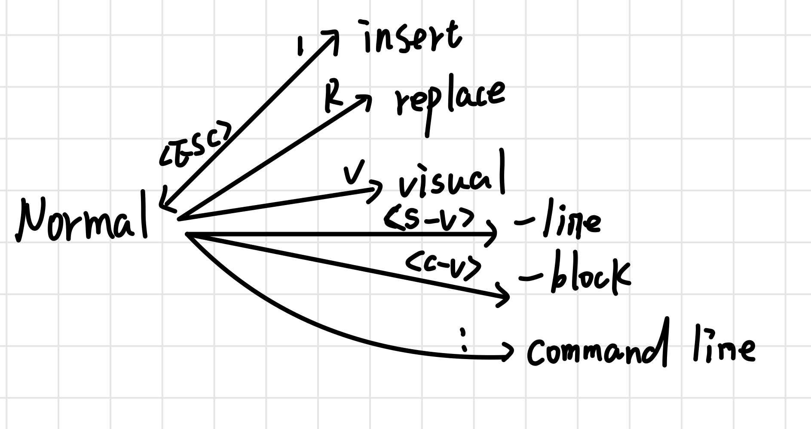

# Lesson 3
vim is a model editor as it has many modes. They trans like following image.

## Normal mode
In normal mode, there are many functional key on the keyboard
|keys|function|
|:----:|:----:|
|w|jump ahead a word|
|b|jump backward a word|
|j|down|
|k|up|
|h|left|
|l|right|
|ctrl+u|up serveral lines|
|ctrl+d|down serveral lines|
|e|end of the word|
|0|head of the line|
|$|end of the line|
|^|jump to the first non-empty character of the line|
|G|bottom of the buffer|
|{num}G|jump to the {num} line|
|gg|top of the buffer|
|L|lowest line of the screen|
|M|middle line of the screen|
|H|highest line of the screen|
|f{character}|find the first {character} after the cursor in current line|
|F{character}|find the first {character} before the cursor in current line|
|t{character}|jump to the first {character} after the cursor in current line, but one character before it|
|T{character}|jump to the first {character} before the cursor in current line, but one character after it|
|d|delete, d is supposed to combined with the keys above to use|
|dw|delete a word|
|dj|delete current line and a line below|
|dd|delete the line|
|c|change, and c works just like d and it will get you into insert mode for changing|
|cc|delete the line and wait for typing in|
|x|delete the character where the cursor is|
|r|replace the charater|
|R|replace more than one character|
|u|undo|
|U|undo the whole line|
|ctrl+r|redo|
|ctrl+R|redo the whole line|
|y|copy,yank|
|p|paste|
|~|change the case of character you select|
|{num}{key}|equivalent to pressing the {key} for {num} times|
|4dw or d4w| delete the 4 words after|
|ci[| change inside the [ ]|
|di(| delete inside the ()|
|da(| delete the () too, around including|
|.|repeat last command|
|a|append after the cursor|
|A|append after the line|
|o|open a new line below to insert|
|O|open a new line above to insert|
## Command mode
In normal mode, type `:` to enter the command line. And here are some commands. And in command mode, you can execute any external command by prepending `!`

| command | meaning|
| :----: | :----: |
| q | quit|
| qa | quit all|
|sp|separate the window|
|w| save|
|wq| save and quit|
|e {name of file}| edit the file|
|ls| show open buffers|
|help {topic}|open help|
|s/old/new|s for substitute, this only changes the first occurance of old word,`/g` will change all the old words in this line|
|n1,n2s/old/new/g|change all the old words in line n1 to line n2|
|%s/old/new/g|change all the old words in this file|
|%s/old/new/gc|change all the old words in this file with a prompt whether to substitute or not|
|w TEST|save the whole file to a new file TEST, you can also switch into the visual mode and select part of content and save them in this way|
|r TEST|retrieve the content of the TEST and insert below the cursor|
|r !ls|put the output of the ls command below the cursor|

## Insert mode

When in normal mode, type `o` will `o`pen a newline below and get you into the insert mode. `O` will open a newline above.

## Visual mode
In this mode, we can select any part of the file by using the keys just like normal mode.
Visual-line selects the whole line at a time. Visual-block selct the block area.

## Macro in vim
Macros is a set of vim operations. q{character} to start recording a macro in register {character}. q to quit recording. @{character} to replay the marco. A macro can be included in other macros. {num}@{character} can replay for {num} times.